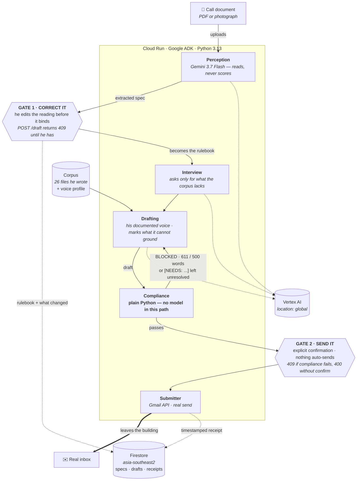

# Berkas

> **berkas** · Indonesian: the file, the dossier, the papers you submit.

**It never invents a claim about your experience. Every sentence in the packet traces to a file you
wrote or an answer you gave.**

An application-filing partner for someone writing to an institution in a language that is not
theirs. Berkas reads the call for applications and reports what it requires. You correct that
reading **before it becomes the rulebook**. It interviews you only for evidence the call demands and
your own files do not already contain, drafts against the spec in your documented voice, and a
deterministic checker blocks the packet on any hard violation. On your explicit confirmation it
files it for real and returns a timestamped receipt.

Built for **All Things Agentic** (Google × Devpost), Collaborative Partner track.

---

## The one design decision everything else follows from

**The model perceives. Code decides.**

Gemini reports what the call document requires — it is allowed to be wrong, because a human corrects
it before anything it says binds. What it is never allowed to do is rule on whether a draft may be
submitted. That verdict is produced by `berkas/compliance.py`: plain Python, standard library only,
no model in the path. The same draft yields the same verdict every time, and a well-written essay
cannot argue its way past a word cap.



### Both gates are in the API, not the button

The disabled button is a courtesy. The gate is the route, and it answers curl the same way it
answers a click:

```bash
# a draft nobody has confirmed the spec for
curl -X POST $URL/api/draft/$SPEC      # 409 — not confirmed by a human

# a packet with a violation, explicitly confirmed
curl -X POST $URL/api/send/$DRAFT \
     -H 'content-type: application/json' -d '{"confirm":true}'   # 409 — violations

# a compliant packet, not confirmed
curl -X POST $URL/api/send/$DRAFT \
     -H 'content-type: application/json' -d '{"confirm":false}'  # 400 — no confirmation
```

`tests/test_gates.py` asserts the negatives that matter: on a blocked send, the transport is never
called and no receipt is written.

## What the checker actually enforces

Four rules, all total, all evaluated — never short-circuited, so a fix-and-recheck cycle converges
instead of playing whack-a-mole. Word counting is `len(text.split())`, documented because an
undocumented count is indistinguishable from a fudged one.

| Rule | Fires when |
|---|---|
| `word_cap` | the section exceeds its cap. *Exceeds*, not reaches: 500/500 is compliant |
| `missing_section` | a required section is absent or whitespace |
| `ungrounded_claim` | the draft still carries a `[NEEDS: ...]` marker |
| `deadline_passed` | the deadline is before today in `Asia/Makassar` |

`ungrounded_claim` is how the promise at the top of this README stops being a slogan. The drafting
agent sees the corpus and the interview answers and nothing else; where a fact is missing it writes
`[NEEDS: the thing it would need]` rather than a plausible sentence, and a packet still carrying one
cannot be sent. On the first real run, given no answers, it refused to invent a host university, a
household income and a community project — and the checker blocked all three.

The drafting agent is never asked to count its own words. Models cannot count reliably, and a model
policing its own compliance is a model marking its own homework.

---

## Run it

Python 3.13 (see `.python-version`) and [uv](https://docs.astral.sh/uv/).

```bash
# 1 · Configure. Gemini 3.x is served ONLY from location "global".
#     The API-key route is not used — do not set GOOGLE_GENAI_USE_VERTEXAI=FALSE.
cat > .env <<'EOF'
GOOGLE_GENAI_USE_VERTEXAI=TRUE
GOOGLE_CLOUD_PROJECT=<your-project-id>
GOOGLE_CLOUD_LOCATION=global
MODEL_ID=gemini-3.7-flash
EOF

# 2 · One-time Google Cloud setup
gcloud services enable aiplatform.googleapis.com firestore.googleapis.com \
                       run.googleapis.com gmail.googleapis.com secretmanager.googleapis.com
gcloud firestore databases create --location=asia-southeast2
./fix-iam.sh    # cloudbuild.builds.builder, aiplatform.user, datastore.user,
                # secretmanager.secretAccessor — all four are needed at runtime

# 3 · Authorise the send, once. Create an OAuth client ID of type "Desktop app"
#     in the console, save the JSON to credentials/oauth_client.json, then:
uv run python scripts/gmail_auth.py
gcloud secrets create berkas-gmail-token --data-file=credentials/gmail_token.json

# 4 · The corpus Berkas may draw on (optional — see below)
uv run python scripts/sync_corpus.py

# 5 · Verify, then run
uv run pytest -q
uv run uvicorn main:app --reload      # http://localhost:8000

# 6 · Deploy
gcloud run deploy berkas --source . --region=us-central1 --allow-unauthenticated \
  --set-env-vars=GOOGLE_GENAI_USE_VERTEXAI=TRUE,GOOGLE_CLOUD_PROJECT=<id>,\
GOOGLE_CLOUD_LOCATION=global,MODEL_ID=gemini-3.7-flash,\
BERKAS_GMAIL_TOKEN_SECRET=berkas-gmail-token,BERKAS_DEMO_RECIPIENT=<you@example.com>
```

### On the corpus

`corpus/` is the author's own application history — the evidence Berkas is allowed to quote. It is
personal data, so it is baked into the container and deliberately **not** published in this
repository. Without it the app runs correctly: the inventory comes back empty, and the interview
agent, finding nothing, asks for everything. Clone this repo and you get a working system that
simply knows nothing about you yet.

### Gotchas, written down because they each cost time

- **Gemini 3.x is served only from `location=global`**, never a regional endpoint, even when Cloud
  Run itself is regional.
- **Homebrew's `python@3.14` ships a broken `_sqlite3`**, so `deploy.sh` pins gcloud to 3.13.
- **A pydantic field named `register` shadows `BaseModel.register`**, and its unset default
  serialises as a bound method, which Firestore rejects at write time. Setting the field by hand
  hides this completely. The field is `voice_register`, with a regression test that deliberately
  leaves it unset.
- **OAuth refresh tokens expire after 7 days while the consent screen is in "Testing".** Publish the
  app (unverified is fine for a single user) or the deployed send stops working a week later.
- **`gcloud run deploy --source .` falls back to `.gitignore` when there is no
  `.gcloudignore`.** `corpus/` is gitignored on purpose, so the first deploy shipped without
  it: the service came up healthy, reported `evidence_files: 0`, and quietly drafted from
  nothing. `.gcloudignore` exists so the two lists can differ.
- `.env` and `credentials/` are gitignored, so every variable is named above.

## Layout

```
berkas/
  perception.py   reads the call document. Reports; never scores.
  interview.py    the gaps between what the call needs and the corpus holds
  drafting.py     writes it, in his voice, marking what it cannot ground
  compliance.py   ★ the gate. Plain Python, stdlib only, no model.
  submitter.py    Gmail API. Narrowest scope that can send: gmail.send
  store.py        Firestore: specs, drafts, receipts
  evidence.py     the corpus, and the voice profile
  api.py          the HTTP surface. Both gates live here.
  models.py       the frozen contracts
static/index.html the three screens. Vanilla JS, no build step.
tests/            compliance rules, and both gates driven over HTTP
PRD.md            scope, contracts and rules, frozen before the code
```

## Disclosure

Per the competition rules on pre-existing work: the ADK deployment skeleton (`agent/agent.py`,
`deploy.sh`, `fix-iam.sh`, `smoke_test.py`, first commit) predates the idea and exists to verify the
deployment path. The application corpus in `corpus/` is personal data used as demo input, not code.
Everything else was built inside the submission window.

*This project was created for the purposes of entering the All Things Agentic Hackathon.*
