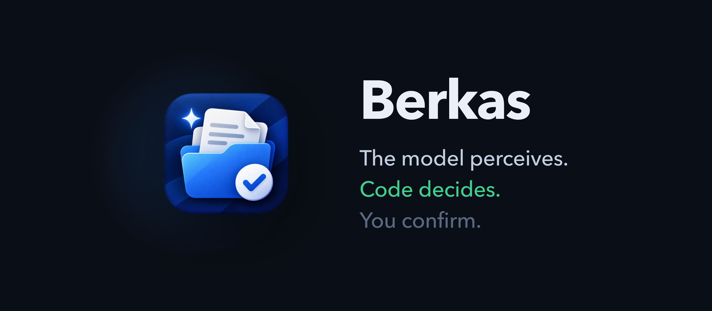
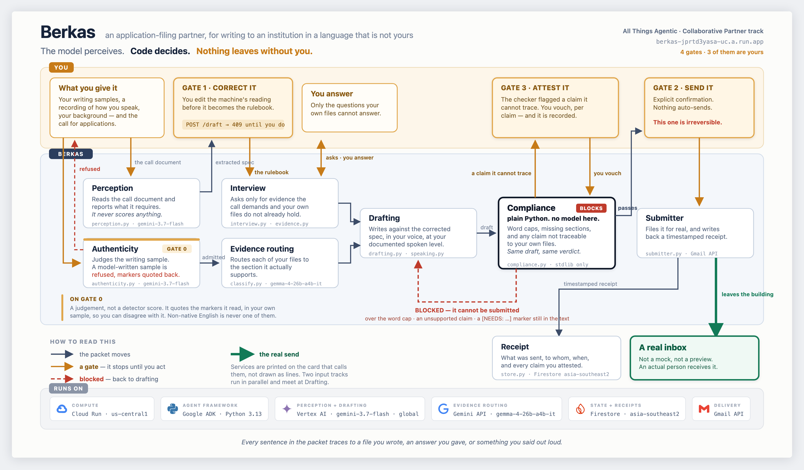
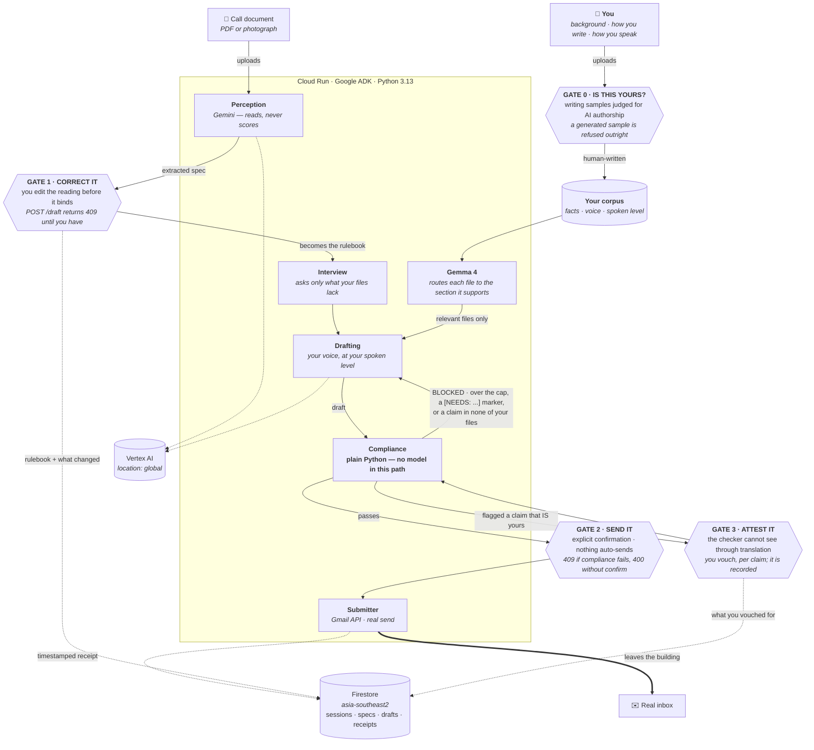

# Berkas

[](https://github.com/codeby-dani/berkas/actions/workflows/ci.yml)
[](LICENSE)
[](https://www.python.org/)
[](https://google.github.io/adk-docs/)
[](https://pypi.org/project/google-genai/)
[](https://cloud.google.com/)
[](https://deepmind.google/technologies/gemini/)
[](https://ai.google.dev/gemma)
[](https://berkas-jprtd3yasa-uc.a.run.app)
[](https://allthingsagentic.devpost.com/)

<picture>
  <source media="(prefers-color-scheme: dark)"  srcset="assets/banner-dark.png">
  <source media="(prefers-color-scheme: light)" srcset="assets/banner-light.png">
  
</picture>

> **berkas** · Indonesian: the file, the dossier, the papers you submit.

**It never invents a claim about your experience. Every sentence in the packet traces to a file you
wrote, an answer you gave, or something you said out loud.**

An application-filing partner for someone writing to an institution in a language that is not
theirs. Berkas reads the call for applications and reports what it requires. You correct that
reading **before it becomes the rulebook**. It interviews you only for evidence the call demands and
your own files do not already contain, drafts against the spec in your voice and at your level, and
a deterministic checker blocks the packet on any hard violation. On your explicit confirmation it
files it for real and returns a timestamped receipt.

**Live:** <https://berkas-jprtd3yasa-uc.a.run.app> · Built for **All Things Agentic** (Google ×
Devpost), Collaborative Partner track.

---

## The one decision everything follows from

**The model perceives. Code decides.**

Gemini reports what the call document requires — it is allowed to be wrong, because a human corrects
it before anything it says binds. What it is never allowed to do is rule on whether a draft may be
submitted. That verdict comes from `berkas/compliance.py`: plain Python, standard library only, no
model in the path. The same draft yields the same verdict every time, and a well-written essay
cannot argue its way past a word cap.



<details>
<summary>The same graph as text, for diffing. The picture above is generated from <code>docs/architecture.html</code>.</summary>



</details>

## Four gates, and every one is recorded

| | Where | What it stops |
|---|---|---|
| **0 · Is this yours?** | uploading a writing sample | A voice built from AI text teaches Berkas to sound like AI. You would get a machine imitating a machine imitating you, and no way to tell. |
| **1 · Correct it** | after perception reads the call | It read the deadline as 14 September. The Vocational scheme files by the 7th, and nothing in the PDF says which scheme you are in. |
| **2 · Send it** | before anything leaves | Nothing auto-sends, and nothing non-compliant sends at all. |
| **3 · Attest it** | when the checker is wrong about you | It compares text, so it cannot see through translation. You vouch per claim, never in bulk. |

Gates 1–3 write what you decided to Firestore: `corrected_fields` beside the model's original
reading, `human_attested` on the receipt, `confirmed_by_human_at` beside the send timestamp.

### The gates live in the API, not the button

The disabled button is a courtesy. The gate is the route, and it answers curl the same way:

```bash
curl -X POST $URL/api/draft/$SPEC                                    # 409 — no human has confirmed the spec
curl -X POST $URL/api/send/$DRAFT -d '{"confirm":true}'              # 409 — violations
curl -X POST $URL/api/send/$DRAFT -d '{"confirm":false}'             # 400 — no confirmation
```

`tests/test_gates.py` asserts the negatives that matter: on a blocked send the transport is never
called and no receipt is written.

## What the checker enforces

Six rules, all total, all evaluated together — never short-circuited, so a fix-and-recheck cycle
converges instead of playing whack-a-mole. Word counting is `len(text.split())`, documented because
an undocumented count is indistinguishable from a fudged one.

| Rule | Fires when |
|---|---|
| `word_cap` | the section exceeds its cap. *Exceeds*, not reaches: 500/500 is compliant |
| `missing_section` | a required section is absent or whitespace |
| `ungrounded_claim` | the draft still carries a `[NEEDS: ...]` marker |
| `unverified_claim` | a named institution or a number appears that is in none of your files |
| `deadline_passed` | the deadline is before today, in `Asia/Makassar` |
| `deadline_unreadable` | the deadline is not a date — shown back to you, never raised |

### The promise, made checkable

`ungrounded_claim` catches gaps the drafting agent marked. `unverified_claim` catches the ones it did
not — and it exists because the agent fabricated a household income of "2,000 USD" in the same
sentence where it marked a different gap. Until then the promise rested on the model choosing to mark
its own gaps, which is a model marking its own homework: the exact thing the rest of this system
refuses. The packet blocked by luck.

So the rule is deterministic. Every number, and every institution-shaped name introduced by a locator
("at MIT", "di Amerika Serikat"), is checked against your corpus, your interview answers and the spec
you confirmed. Anything attested nowhere blocks the packet.

It compares strings, so it cannot see through translation — a section saying *Universitas Telkom*
against a corpus that says *Telkom University* is flagged. That is what Gate 3 is for.

## Bring your own corpus

Berkas only says what you have already said, so the first screen collects it. Three inputs, kept
apart because mixing them is what produced the first draft's corporate slop:

| Input | Read for | Never used for |
|---|---|---|
| **Your background** — CV, past applications | facts it may state about you | style |
| **How you write** — a LinkedIn post, a long message | style | evidence |
| **How you speak** — recorded in the browser | your spoken level and rhythm | evidence |

**The recording is the part a written sample cannot give you.** Someone fluent on the page may reach
for simpler words when a room is looking at them, and a model asked to write a talk reaches for the
most articulate phrasing it can. So Berkas profiles the level you actually speak at and writes to it.
A real run:

```
Level: B1
fillers : Yeah so, um, I think, uh
avoid   : hallucination, mitigate, verification pipeline, subsequently, facilitate
guidance: Short sentences linked with 'and' or 'so'. Everyday phrasing like
          'make up things' or 'checker' rather than 'validation system'.
```

That `avoid` list is fed to drafting. A B1 speaker handed a C1 script stumbles through it in front of
a room, and has to defend every sentence of a C1 personal statement in an interview.

**Whose files are "your files"?** A session that gives Berkas anything — a file or a recording — uses
only that session's material. No background means *no background*, and every specific gets marked.
The bundled corpus is used **only** for a session that gave nothing at all, so the demo works on a
fresh visit and a fork works for whoever cloned it. Falling back per-pile would check a stranger's
claims against the author's CV, silently.

`corpus/` on disk is the author's own history: baked into the container, gitignored, never published.
So that the sentence above is true for a fork and not only on the author's laptop, this repository
ships `corpus.example/`: a fictional applicant, invented end to end, naming no real institution.
Point `BERKAS_CORPUS` at it, or put your own files in `corpus/` and Berkas reads those instead. CI
runs the suite against `corpus.example/`, which is what makes the badge mean anything on a clean
checkout.

## Gate 0, and what it can and cannot do

Writing samples offered as *style* are judged before they are stored, and a generated one is refused
outright. The refusal quotes fragments of your own sample, because a verdict you cannot check against
your own words is worthless to you. Background files are never judged — a CV is allowed to read like
a CV.

**Tested both ways.** A ChatGPT-flavoured LinkedIn post is refused with high confidence on markers
like *"leverage diverse perspectives and deliver robust solutions"*. But a model **instructed** to
write informally, with invented mundane detail — a warung with blue chairs, three Notion pages for
one project — was accepted as human with high confidence. That file was generated. It was not caught.

So the claim is deliberately narrow: **it refuses samples that read as generated.** A guard against
carelessness, which is the realistic failure, not against an adversary. No detector can prove
authorship, and one that claimed to would be lying. `samples/detector-test/` holds both fixtures so
the boundary can be re-checked rather than taken on trust.

Non-native English is explicitly *not* a signal. A model writes smoother English than most
second-language writers, so penalising roughness would refuse exactly the people this is built for.

## Two models, doing different jobs

| Runs on | Job | Module |
|---|---|---|
| Gemini 3.7 Flash | reads the call document, reports what it requires | `perception.py` |
| Gemini 3.7 Flash | finds what the call needs that your files do not answer | `interview.py` |
| Gemini 3.7 Flash | drafts, in your voice, at your level | `drafting.py` |
| Gemini 3.7 Flash | judges whether a writing sample is human-written | `authenticity.py` |
| Gemini 3.7 Flash | transcribes a recording and profiles how you speak | `speaking.py` |
| **Gemma 4** | routes each corpus file to the sections it supports | `classify.py` |
| **plain Python** | **decides whether it may be submitted** | `compliance.py` |

Gemma is reached through the Gemini API, not Vertex: it is open-weights, so there is no managed
endpoint, and self-hosting needs GPU quota this project measures at **0 across all 60 GPU types**.
That route is intermittent — the same call has taken 25 seconds, returned 429, and failed to answer
inside ten minutes. So routing runs on a **20-second budget, off the event loop**, and drafting
proceeds with the whole corpus when that budget is spent. The interface says so rather than hiding
it. Routing narrows; it never starves, and it is never load-bearing.

## Try it

<https://berkas-jprtd3yasa-uc.a.run.app> — light or dark, English or Indonesian, toggles top right.

1. **Skip** the corpus screen to use the bundled demo, or upload your own.
2. Drop `samples/hard-call-for-applications.pdf`. It is built to be awkward: an erratum that
   supersedes the table above it, a limit in pages, a limit in characters, an optional component, a
   withdrawn component that must not be extracted, a second deadline for one scheme, a mandatory
   section in Indonesian, and nine numeric distractors that must not become word caps.
3. On the spec screen, change the deadline to `2026-09-07` — you are D3, so the Vocational deadline
   binds you, and nothing in the PDF says which scheme you are in.
4. Answer two interview questions, skip one on purpose, and watch it mark the gap rather than fill it.

```bash
uv run python scripts/stress_test.py     # scores perception on that PDF: 10/10 traps
```

The answer key is `samples/EXPECTED.md`, and the checks are machine-verified, because "the extraction
looked good" is not a result.

## Run it

Python 3.13 (see `.python-version`) and [uv](https://docs.astral.sh/uv/).

```bash
# 1 · Configure. Gemini 3.x is served ONLY from location "global".
cat > .env <<'EOF'
GOOGLE_GENAI_USE_VERTEXAI=TRUE
GOOGLE_CLOUD_PROJECT=<your-project-id>
GOOGLE_CLOUD_LOCATION=global
MODEL_ID=gemini-3.7-flash
GOOGLE_API_KEY=<a Gemini API key, for Gemma only>
EOF

# 2 · One-time Google Cloud setup
gcloud services enable aiplatform.googleapis.com firestore.googleapis.com \
                       run.googleapis.com gmail.googleapis.com secretmanager.googleapis.com
gcloud firestore databases create --location=asia-southeast2
./fix-iam.sh    # cloudbuild.builds.builder, aiplatform.user, datastore.user,
                # secretmanager.secretAccessor — all four are needed at runtime

# 3 · Authorise the send, once. Create an OAuth client ID of type "Desktop app"
#     in the console, save the JSON to credentials/oauth_client.json, then:
uv run python scripts/gmail_auth.py
gcloud secrets create berkas-gmail-token --data-file=credentials/gmail_token.json

# 4 · Optional: the bundled fallback corpus
uv run python scripts/sync_corpus.py

# 5 · Verify, then run. Skipped step 4? corpus/ is empty — use the example instead:
BERKAS_CORPUS=corpus.example uv run pytest -q
uv run uvicorn main:app --reload      # http://localhost:8000

# 6 · Deploy
./deploy-berkas.sh
```

### Gotchas, written down because they each cost time

- **Gemini 3.x is served only from `location=global`**, never a regional endpoint, even when Cloud
  Run itself is regional.
- **`uv add` does not update `requirements.txt`.** The container installs from that file, so adding a
  dependency and deploying without re-exporting ships an image missing it — the module imports fine
  locally the whole time. `deploy-berkas.sh` regenerates it every deploy for exactly this reason.
- **`gcloud run deploy --source .` falls back to `.gitignore` when there is no `.gcloudignore`.**
  `corpus/` is gitignored on purpose, so the first deploy shipped without it: the service came up
  healthy, reported `evidence_files: 0`, and quietly drafted from nothing.
- **A synchronous client call inside an `async` route blocks the whole event loop.** Invisible
  locally with one request in flight; on Cloud Run a draft sat blocked for 599 seconds and was killed.
- **Routing must not multiply how much text is sent.** Flattening the corpus once per section turned
  a 119k-character corpus into a 716k-character prompt for a six-section call.
- **`access_secret_version` takes `request=`, not `name=`.** That branch only runs on Cloud Run, so
  it passed every local test and then 500'd on the one request the project is about.
- **A pydantic field named `register` shadows `BaseModel.register`**, and its unset default serialises
  as a bound method, which Firestore rejects. Setting the field by hand hides it completely.
- **OAuth refresh tokens expire after 7 days while the consent screen is in "Testing".** Publish the
  app, or the deployed send stops working a week later.
- `.env`, `credentials/` and `corpus/` are gitignored, so every variable is named above.

## Layout

```
berkas/
  authenticity.py  Gate 0. Is this writing sample human-written?
  perception.py    reads the call document. Reports; never scores.
  interview.py     the gaps between what the call needs and the corpus holds
  speaking.py      transcribes a recording; profiles level, rhythm, vocabulary
  classify.py      Gemma 4 — routes corpus files to sections. Fails soft.
  drafting.py      writes it, in your voice, marking what it cannot ground
  compliance.py    ★ the gate. Plain Python, stdlib only, no model.
  submitter.py     Gmail API. Narrowest scope that can send: gmail.send
  store.py         Firestore: sessions, specs, drafts, receipts
  evidence.py      the corpus: uploaded per session, or the bundled fallback
  api.py           the HTTP surface. Every gate lives here.
  models.py        the frozen contracts
static/index.html  the screens. Vanilla JS, no build step, light/dark, EN/ID.
tests/             compliance rules, all four gates, Gemma's fallbacks, the corpus
samples/           an awkward call document, its answer key, detector fixtures
docs/architecture.html  the diagram above. Regenerate the PNG from it; do not redraw it.
PRD.md             scope, contracts and rules, frozen before the code
```

## Disclosure

Per the competition rules on pre-existing work: the ADK deployment skeleton (`agent/agent.py`,
`deploy.sh`, `fix-iam.sh`, `smoke_test.py` — the first commit) predates this idea and exists to
verify the deployment path. The corpus in `corpus/` is personal data used as demo input, not code,
and is not published. Everything else was built inside the submission window.

*This project was created for the purposes of entering the All Things Agentic Hackathon.*
